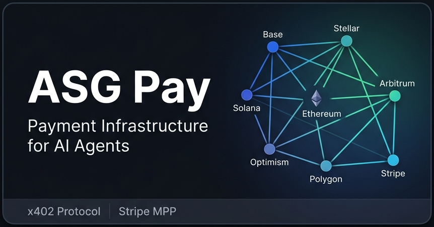
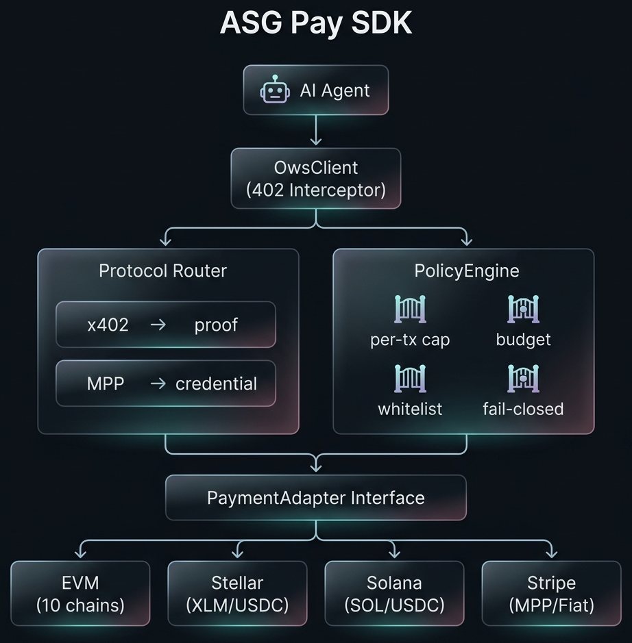

<p align="center">
  
</p>

<h3 align="center">Bi-directional payment infrastructure for AI agents.</h3>

<p align="center">
  <sub>15 networks · Pay Out + Pay In · x402 + MPP · Server-side 402 gating · Real-time monitoring</sub>
</p>

<p align="center">
  <a href="https://github.com/ASGCompute/ASGCompute-ows-agent-pay/actions/workflows/ci.yml"></a>
  <a href="https://www.npmjs.com/package/@asgcard/pay"></a>
  <a href="https://www.npmjs.com/package/@asgcard/pay"></a>
  
  
  
  <a href="LICENSE"></a>
  
</p>

<p align="center">
  <a href="#-table-of-contents">Contents</a>&nbsp;&nbsp;·&nbsp;&nbsp;
  <a href="#-quick-start">Quick Start</a>&nbsp;&nbsp;·&nbsp;&nbsp;
  <a href="#-architecture">Architecture</a>&nbsp;&nbsp;·&nbsp;&nbsp;
  <a href="#-supported-networks-15">Networks</a>&nbsp;&nbsp;·&nbsp;&nbsp;
  <a href="#-ecosystem--products">Ecosystem</a>&nbsp;&nbsp;·&nbsp;&nbsp;
  <a href="https://pay.asgcard.dev">Docs</a>&nbsp;&nbsp;·&nbsp;&nbsp;
  <a href="https://asgcompute.github.io/ASGCompute-ows-agent-pay/">Live Demo</a>
</p>

---

## 📋 Table of Contents

- [🔥 The Problem](#-the-problem)
- [⚡ Quick Start — Pay Out](#-quick-start--pay-out)
  - [EVM (Base, Arbitrum, Optimism…)](#evm-base-arbitrum-optimism)
  - [Stellar (XLM / USDC)](#-stellar-xlm--usdc)
  - [Solana (SOL / USDC)](#-solana-sol--usdc)
  - [Stripe MPP (Fiat)](#-stripe-mpp-fiat)
- [🏗 Architecture](#-architecture)
- [🔒 Pay In: Server-Side 402 Gating](#-pay-in-server-side-402-gating)
- [👁 Pay In: Real-Time Payment Monitoring](#-pay-in-real-time-payment-monitoring)
- [🔗 Pay In: Payment Request URIs](#-pay-in-payment-request-uris)
- [🌍 Supported Networks (15)](#-supported-networks-15)
- [🔀 Dual Protocol Support](#-dual-protocol-support)
- [🛡 Policy Engine](#-policy-engine)
- [🌐 Ecosystem & Products](#-ecosystem--products)
  - [ASG Pay — SDK](#-asg-pay--the-sdk)
  - [ASG Card — Virtual Cards](#-asg-card--virtual-cards-for-ai-agents)
  - [ASG Fund — One-Link Funding](#-asg-fund--one-link-agent-funding)
  - [MCP Server — AI Agent Tools](#-mcp-server--ai-agent-tools)
- [📦 All Packages](#-all-packages)
- [🧪 Testing](#-testing)
- [🤝 Partners & Integrations](#-partners--integrations)
- [🛠 Technology Stack](#-technology-stack)
- [📜 License](#-license)

---

## 🔥 The Problem

AI agents are autonomous workers — but they can't **pay** for anything, and they can't **earn** anything. When an agent hits `HTTP 402 Payment Required`, it stops dead. When it produces value, there's no way to charge.

**ASG Pay** is bi-directional payment infrastructure:

- **Pay Out** → Agent auto-settles 402 challenges on-chain
- **Pay In** → Your API returns 402 until the caller pays

The agent just calls `performTask()` — the SDK handles everything:

```
Agent → API request → 402 "Pay $0.50" → SDK auto-settles on-chain → Agent gets response
```

Zero payment code in your agent. One line to install:

```bash
npm install @asgcard/pay
```

---

## ⚡ Quick Start — Pay Out

### EVM (Base, Arbitrum, Optimism…)

```typescript
import { OwsClient, EvmPaymentAdapter } from '@asgcard/pay';

const agent = new OwsClient({
  baseURL: 'https://api.example.com',
  adapter: new EvmPaymentAdapter({
    chain: 'base',           // or: 'arbitrum', 'optimism', 'ethereum', 'polygon'
    asset: 'USDC',           // or: 'native' for ETH/MATIC
    privateKey: process.env.AGENT_KEY as `0x${string}`,
  }),
  policy: {
    maxAmountPerTransaction: 5,   // $5 cap per payment
    monthlyBudget: 100,           // $100/month total
  },
});

// Your agent code — zero payment logic needed
const data = await agent.performTask('/v1/inference', {
  model: 'gpt-4',
  messages: [{ role: 'user', content: 'Summarize this research paper' }],
});
```

<details>
<summary><strong>🌐 Stellar (XLM / USDC)</strong></summary>

```typescript
import { OwsClient, StellarPaymentAdapter } from '@asgcard/pay';

const agent = new OwsClient({
  baseURL: 'https://api.example.com',
  adapter: new StellarPaymentAdapter({
    secretKey: process.env.STELLAR_SECRET!,
    network: 'mainnet',      // or: 'testnet'
    asset: 'USDC',           // Circle USDC on Stellar
  }),
  policy: { monthlyBudget: 50, maxAmountPerTransaction: 2 },
});
```

**Capabilities:** Auto trustline management · XLM + USDC · Mainnet + Testnet

</details>

<details>
<summary><strong>◎ Solana (SOL / USDC)</strong></summary>

```typescript
import { OwsClient, SolanaPaymentAdapter } from '@asgcard/pay';

const agent = new OwsClient({
  baseURL: 'https://api.example.com',
  adapter: new SolanaPaymentAdapter({
    secretKey: myKeypair.secretKey,
    network: 'mainnet-beta',  // or: 'devnet'
    asset: 'USDC',            // Circle USDC SPL token
  }),
  policy: { monthlyBudget: 50, maxAmountPerTransaction: 2 },
});
```

**Capabilities:** Auto ATA creation · SOL + USDC SPL · Mainnet-beta + Devnet · Airdrop protection (1 SOL cap on devnet)

</details>

<details>
<summary><strong>💳 Stripe MPP (Fiat)</strong></summary>

```typescript
import { OwsClient, StripePaymentAdapter } from '@asgcard/pay';

const agent = new OwsClient({
  baseURL: 'https://api.example.com',
  adapter: new StripePaymentAdapter({
    stripeSecretKey: process.env.STRIPE_SECRET_KEY!,
    networkId: 'my-network',
  }),
  policy: { monthlyBudget: 200, maxAmountPerTransaction: 10 },
});
```

**Capabilities:** SPT lifecycle management · Crypto-deposit PaymentIntent via Tempo · Server-side 402 challenge builder

</details>

---

## 🏗 Architecture

<p align="center">
  
</p>

<table>
<tr>
<th>Component</th>
<th>File</th>
<th>What it does</th>
</tr>
<tr>
<td><strong>OwsClient</strong></td>
<td><a href="src/client.ts">client.ts</a></td>
<td>Dual-protocol HTTP client. Intercepts 402, auto-detects x402 vs MPP, settles, retries.</td>
</tr>
<tr>
<td><strong>PolicyEngine</strong></td>
<td><a href="src/policy.ts">policy.ts</a></td>
<td>Fail-closed 4-gate budget controller. Rejects everything by default.</td>
</tr>
<tr>
<td><strong>MPP Protocol</strong></td>
<td><a href="src/mpp.ts">mpp.ts</a></td>
<td>RFC 7235 WWW-Authenticate parser, credential builder, protocol detector.</td>
</tr>
<tr>
<td><strong>EvmPaymentAdapter</strong></td>
<td><a href="src/adapters/evm.ts">adapters/evm.ts</a></td>
<td>10 EVM chains. ETH/MATIC + Circle USDC. One class, all chains.</td>
</tr>
<tr>
<td><strong>StellarPaymentAdapter</strong></td>
<td><a href="src/adapters/stellar.ts">adapters/stellar.ts</a></td>
<td>Stellar XLM + USDC with auto trustline management. Mainnet + Testnet.</td>
</tr>
<tr>
<td><strong>SolanaPaymentAdapter</strong></td>
<td><a href="src/adapters/solana.ts">adapters/solana.ts</a></td>
<td>SOL + USDC SPL with auto ATA creation. Mainnet-beta + Devnet.</td>
</tr>
<tr>
<td><strong>StripePaymentAdapter</strong></td>
<td><a href="src/adapters/stripe.ts">adapters/stripe.ts</a></td>
<td>Stripe MPP. SPT lifecycle, crypto deposits via Tempo, server challenge builder.</td>
</tr>
</table>

> **Pluggable**: Add any chain by implementing the [`PaymentAdapter`](src/adapters/types.ts) interface (~40 lines).

#### Pay In Modules (NEW in v0.2.0)

| Component | File | What it does |
|-----------|------|--------------|
| **x402Gate** | [`server/x402-gate.ts`](src/server/x402-gate.ts) | Server-side x402 middleware. Returns 402 + JSON challenge, validates `X-PAYMENT` proofs. |
| **MppGate** | [`server/mpp-gate.ts`](src/server/mpp-gate.ts) | Server-side MPP middleware. Returns 402 + `WWW-Authenticate`, validates credentials. |
| **PaymentGate** | [`server/payment-gate.ts`](src/server/payment-gate.ts) | Dual-protocol unified gate. Auto-detects x402 vs MPP. |
| **WebhookHandler** | [`server/webhook.ts`](src/server/webhook.ts) | Stripe webhook with HMAC-SHA256 verification + idempotency. |
| **EvmWatcher** | [`monitor/evm-watcher.ts`](src/monitor/evm-watcher.ts) | Real-time ERC-20 + native ETH transfer detection via JSON-RPC polling. |
| **StellarWatcher** | [`monitor/stellar-watcher.ts`](src/monitor/stellar-watcher.ts) | Horizon SSE streaming for incoming Stellar payments. |
| **SolanaWatcher** | [`monitor/solana-watcher.ts`](src/monitor/solana-watcher.ts) | SOL + SPL token transfer detection via `getSignaturesForAddress`. |
| **URI Builders** | [`requests/`](src/requests/) | EIP-681, SEP-7, Solana Pay URI generators for QR codes and payment links. |

---

## 🔒 Pay In: Server-Side 402 Gating

Protect any API endpoint behind a paywall. Agents must pay before accessing resources.

```typescript
import { createPaymentGate } from '@asgcard/pay';

// Dual-protocol gate — supports both x402 and MPP simultaneously
app.post('/api/premium', createPaymentGate({
  x402: {
    payTo: '0xYOUR_WALLET',
    amount: '500000',       // 0.50 USDC (6 decimals)
    asset: 'USDC',
    network: 'eip155:8453', // Base
  },
  mpp: {
    realm: 'api.example.com',
    method: 'onchain',
    amount: '0.50',
    recipient: '0xYOUR_WALLET',
  },
}), (req, res) => {
  res.json({ data: 'premium content' });
});
```

**What happens:**
1. Agent sends request with no payment → gets `402` + challenge (both x402 JSON body + MPP `WWW-Authenticate` header)
2. Agent pays on-chain (or via Stripe SPT)
3. Agent retries with proof → middleware validates → `200 OK`

---

## 👁 Pay In: Real-Time Payment Monitoring

Watch for incoming payments across all chains simultaneously:

```typescript
import { createMultiChainWatcher } from '@asgcard/pay';

const unsub = createMultiChainWatcher({
  evm: [
    { address: '0x...', rpcUrl: 'https://mainnet.base.org', chainName: 'Base',
      usdcContractAddress: '0x833589fCD6eDb6E08f4c7C32D4f71b54bdA02913', onPayment: () => {} },
  ],
  stellar: { accountId: 'GABC...', onPayment: () => {} },
  solana: { address: '7abc...', onPayment: () => {} },
  onPayment: (event) => {
    console.log(`💰 ${event.chain}: ${event.amountFormatted} ${event.asset} from ${event.from}`);
  },
});

// Stop all watchers
unsub();
```

| Chain | Mechanism | Assets |
|-------|-----------|--------|
| **EVM (15 chains)** | `eth_getLogs` polling for ERC-20 Transfer events | USDC, ETH/MATIC |
| **Stellar** | Horizon SSE `/payments` stream | XLM, USDC |
| **Solana** | `getSignaturesForAddress` + tx parsing | SOL, USDC SPL |

---

## 🔗 Pay In: Payment Request URIs

Generate chain-specific payment URIs for QR codes, deep links, or agent-to-agent requests:

```typescript
import { buildPaymentUri } from '@asgcard/pay';

// EIP-681 (EVM)
const evmUri = buildPaymentUri({
  chain: 'evm',
  evm: { to: '0x...', amount: '10', asset: '0xUSDC_CONTRACT', decimals: 6, chainId: 8453 },
});
// → 'ethereum:0xUSDC_CONTRACT/transfer?address=0x...&uint256=10000000&chainId=8453'

// SEP-7 (Stellar)
const stellarUri = buildPaymentUri({
  chain: 'stellar',
  stellar: { destination: 'GABC...', amount: '100', assetCode: 'USDC', assetIssuer: 'GA5Z...' },
});
// → 'web+stellar:pay?destination=GABC...&amount=100&asset_code=USDC&asset_issuer=GA5Z...'

// Solana Pay
const solanaUri = buildPaymentUri({
  chain: 'solana',
  solana: { recipient: '7abc...', amount: '25', splToken: 'EPjFWdd5...' },
});
// → 'solana:7abc...?amount=25&spl-token=EPjFWdd5...'
```

---

## 🌍 Supported Networks (15)

<table>
<tr>
<td>

### EVM (10 chains)

| Chain | Mainnet | Testnet | USDC |
|-------|:-------:|:-------:|:----:|
| **Base** | `eip155:8453` | `eip155:84532` | ✅ Circle |
| **Arbitrum** | `eip155:42161` | `eip155:421614` | ✅ Circle |
| **Optimism** | `eip155:10` | `eip155:11155420` | ✅ Circle |
| **Ethereum** | `eip155:1` | `eip155:11155111` | ✅ Circle |
| **Polygon** | `eip155:137` | `eip155:80002` | ✅ Circle |

</td>
<td>

### Non-EVM (5)

| Network | CAIP-2 | Assets |
|---------|--------|--------|
| **Stellar Mainnet** | `stellar:pubnet` | XLM, USDC |
| **Stellar Testnet** | `stellar:testnet` | XLM, USDC |
| **Solana Mainnet** | `solana:5eykt4…` | SOL, USDC |
| **Solana Devnet** | `solana:4uhcVJ…` | SOL, USDC |
| **Stripe MPP** | `stripe:live` | USD (fiat) |

</td>
</tr>
</table>

> All USDC contracts are [Circle's official native deployments](https://developers.circle.com/stablecoins/docs/usdc-on-main-networks). All RPCs verified live.

---

## 🔀 Dual Protocol Support

ASG Pay is the **only SDK** that natively supports both major machine payment protocols:

<table>
<tr>
<td width="50%">

### x402 Protocol
<sub>Coinbase · Cloudflare · Base</sub>

```
Server → 402 + JSON body
         { x402Version: 1, accepts: [...] }

Agent  → On-chain tx
       → X-PAYMENT: <base64 proof>

Server → 200 OK ✅
```

</td>
<td width="50%">

### Machine Payments Protocol (MPP)
<sub>Stripe · Tempo · Stellar</sub>

```
Server → 402
       → WWW-Authenticate: Payment
         id="ch1", method="stripe"

Agent  → Create SPT
       → Authorization: Payment <cred>

Server → 200 OK + Payment-Receipt ✅
```

</td>
</tr>
</table>

---

## 🛡 Policy Engine

Every payment passes through **4 fail-closed gates**. If any gate fails → payment is silently rejected. No override. No bypass.

```
 ┌─ Gate 1: amount > 0 ───────────┐
 │  Rejects zero/negative amounts  │
 └─────────────────────────────────┘
              │ pass
 ┌─ Gate 2: per-tx limit ─────────┐
 │  $10 request, $5 limit → ❌     │
 └─────────────────────────────────┘
              │ pass
 ┌─ Gate 3: monthly budget ────────┐
 │  $3 + $98 spent > $100 → ❌     │
 └─────────────────────────────────┘
              │ pass
 ┌─ Gate 4: destination whitelist ─┐
 │  Unknown address → ❌            │
 └─────────────────────────────────┘
              │ pass
           ✅ SETTLED
```

---

## 🌐 Ecosystem & Products

ASG Pay is the core engine powering a suite of **live production products**:

---

### ⚡ ASG Pay — The SDK

> **Multi-chain payment SDK for AI agents** — this repository.

| | |
|---|---|
| **Install** | `npm install @asgcard/pay` |
| **Networks** | 15 (10 EVM + 2 Stellar + 2 Solana + 1 Stripe) |
| **Protocols** | x402 (Coinbase) + MPP (Stripe) |
| **Tests** | 269 tests, 84% coverage, 100% CI green |
| **Website** | [pay.asgcard.dev](https://pay.asgcard.dev) |

**Quick demo:**

```bash
# Clone and run tests
git clone https://github.com/ASGCompute/ASGCompute-ows-agent-pay.git
cd ASGCompute-ows-agent-pay
npm install
npm test          # 269 tests pass (5 Stripe live skipped without key)

# Try the interactive demo
npx ts-node demo.ts
```

---

### 💳 ASG Card — Virtual Cards for AI Agents

> Issue virtual MasterCards for AI agents. Fund via USDC on Stellar. Freeze, unfreeze, set spending limits — all programmatic.

| | |
|---|---|
| **Install** | `npx @asgcard/cli` |
| **SDK** | `npm install @asgcard/sdk` |
| **Website** | [asgcard.dev](https://asgcard.dev) |
| **Features** | Issue cards · Set limits · Fund via USDC · Freeze/Unfreeze |

**Quick start:**

```bash
# Issue a virtual card for your agent
npx @asgcard/cli create-card --name "My Agent" --limit 100

# Or use the SDK programmatically
npm install @asgcard/sdk
```

```typescript
import { AsgCardClient } from '@asgcard/sdk';

const client = new AsgCardClient({ apiKey: process.env.ASG_API_KEY! });
const card = await client.createCard({
  name: 'Research Agent',
  spendingLimit: 100,      // $100 monthly
  currency: 'USD',
});
console.log(`Card issued: **** ${card.last4}`);
```

---

### 💰 ASG Fund — One-Link Agent Funding

> Generate a single payment link to fund any AI agent. Supports credit card, bank transfer, and crypto deposits.

| | |
|---|---|
| **Install** | `npm install @asgcard/fund` |
| **Website** | [fund.asgcard.dev](https://fund.asgcard.dev) |
| **Features** | Stripe checkout · Crypto bridge (ROZO) · One-click funding |

**Quick start:**

```bash
npm install @asgcard/fund
```

```typescript
import { createFundingLink } from '@asgcard/fund';

const link = await createFundingLink({
  agentId: 'agent-123',
  amount: 50,              // $50 funding
  methods: ['card', 'crypto'],
});
// → https://fund.asgcard.dev/pay/abc123
```

---

### 🤖 MCP Server — AI Agent Tools

> 11 tools for Claude, Codex, Cursor. Natural language card management via Model Context Protocol.

| | |
|---|---|
| **Install** | `npm install @asgcard/mcp-server` |
| **npm** | [@asgcard/mcp-server](https://www.npmjs.com/package/@asgcard/mcp-server) |
| **Tools** | 11 MCP tools |
| **Agents** | Claude · ChatGPT · Codex · Cursor |

**Quick start:**

```json
// Add to your Claude/Cursor MCP config:
{
  "mcpServers": {
    "asgcard": {
      "command": "npx",
      "args": ["@asgcard/mcp-server"],
      "env": { "ASG_API_KEY": "your-key" }
    }
  }
}
```

```
// Then just say to your AI:
"Create a virtual card for my research agent with a $50 limit"
"Fund my agent wallet with $100 via Stripe"
"Show all active cards and their spending"
```

---

## 📦 All Packages

| Package | Version | Downloads | Description |
|---------|---------|-----------|-------------|
| **[@asgcard/pay](https://www.npmjs.com/package/@asgcard/pay)** | [](https://www.npmjs.com/package/@asgcard/pay) | [](https://www.npmjs.com/package/@asgcard/pay) | Multi-chain payment SDK (this repo) |
| **[@asgcard/cli](https://www.npmjs.com/package/@asgcard/cli)** | [](https://www.npmjs.com/package/@asgcard/cli) | [](https://www.npmjs.com/package/@asgcard/cli) | Virtual card CLI — create, fund, freeze |
| **[@asgcard/sdk](https://www.npmjs.com/package/@asgcard/sdk)** | [](https://www.npmjs.com/package/@asgcard/sdk) | [](https://www.npmjs.com/package/@asgcard/sdk) | Card management TypeScript SDK |
| **[@asgcard/mcp-server](https://www.npmjs.com/package/@asgcard/mcp-server)** | [](https://www.npmjs.com/package/@asgcard/mcp-server) | [](https://www.npmjs.com/package/@asgcard/mcp-server) | MCP server — 11 AI agent tools |
| **[@asgcard/fund](https://www.npmjs.com/package/@asgcard/fund)** | [](https://www.npmjs.com/package/@asgcard/fund) | [](https://www.npmjs.com/package/@asgcard/fund) | Payment link generator |

---

## 🧪 Testing

```bash
# All 264 unit tests (no secrets needed)
npm test

# Full 269 including live Stripe integration
STRIPE_SECRET_KEY=sk_live_… npm test

# Coverage report (84% enforced)
npm run test:coverage

# Type checking
npm run typecheck

# Build + verify package
npm run build && npm pack --dry-run
```

| Suite | Tests | Coverage |
|-------|-------|----------|
| `evm.test.ts` | 44 | 10 chains, native + USDC, balances |
| `mpp.test.ts` | 26 | Challenge parsing, credentials, detection |
| `stripe.test.ts` | 25 | SPT flow, PI creation, server challenges |
| `policy.test.ts` | 20 | All 4 gates, budget tracking, reset |
| `stellar.test.ts` | 19 | XLM/USDC, trustline, both networks |
| `solana.test.ts` | 18 | SOL/USDC, ATA, airdrop protection |
| `base.test.ts` | 17 | BasePaymentAdapter full coverage |
| `client.test.ts` | 16 | Dual-protocol 402, MPP, retry logic |
| `mpp-gate.test.ts` | 11 | MPP server gate, challenges, credentials |
| `x402-gate.test.ts` | 10 | x402 server gate, proofs, rejection |
| `receipt.test.ts` | 7 | Receipt builder/parser |
| `webhook.test.ts` | 6 | Stripe HMAC, idempotency, routing |
| `stellar-watcher.test.ts` | 6 | SSE, asset filter, error handling |
| `evm-watcher.test.ts` | 5 | ERC-20 detection, polling, unsubscribe |
| `solana-watcher.test.ts` | 5 | SOL transfer, RPC error, cleanup |
| `multi-watcher.test.ts` | 5 | Multi-chain aggregator, lifecycle |
| `payment-gate.test.ts` | 4 | Dual-protocol detection, routing |
| `payment-uri.test.ts` | 22 | EIP-681, SEP-7, Solana Pay, universal |
| `stripe.integration.test.ts` | 5 | **Live Stripe API** — real PaymentIntents |
| **Total** | **269** | **84.38% coverage** ✅ |

---

## 🤝 Partners & Integrations

<p align="center">
  <a href="https://base.org"></a>&nbsp;
  <a href="https://circle.com"></a>&nbsp;
  <a href="https://stellar.org"></a>&nbsp;
  <a href="https://solana.com"></a>&nbsp;
  <a href="https://stripe.com"></a>&nbsp;
  <a href="https://arbitrum.io"></a>&nbsp;
  <a href="https://optimism.io"></a>&nbsp;
  <a href="https://ethereum.org"></a>&nbsp;
  <a href="https://polygon.technology"></a>
</p>

---

## 🛠 Technology Stack

| Layer | Stack |
|-------|-------|
| **EVM** | [viem](https://viem.sh) — type-safe client from the Wagmi team |
| **Stellar** | [@stellar/stellar-sdk](https://stellar.org) — official Stellar Foundation |
| **Solana** | [@solana/web3.js](https://solana.com) + [@solana/spl-token](https://spl.solana.com/token) |
| **Stripe** | Stripe API `2026-03-04.preview` with native MPP/SPT |
| **HTTP** | [axios](https://axios-http.com) with interceptor-based 402 handling |
| **Build** | TypeScript strict mode, dual CJS + ESM output via [tsup](https://tsup.egoist.dev) |
| **Test** | [Vitest](https://vitest.dev) — 269 tests, 84% coverage, CI-ready |
| **CI/CD** | [GitHub Actions](https://github.com/ASGCompute/ASGCompute-ows-agent-pay/actions) — Node 18/20/22 matrix |

---

## 📜 License

MIT — see [LICENSE](LICENSE) for details.

---

<p align="center">
  <strong>Built by <a href="https://asgcompute.com">ASG Compute</a></strong>
  <br><br>
  <a href="https://pay.asgcard.dev">pay.asgcard.dev</a>&nbsp;&nbsp;·&nbsp;&nbsp;
  <a href="https://fund.asgcard.dev">fund.asgcard.dev</a>&nbsp;&nbsp;·&nbsp;&nbsp;
  <a href="https://asgcard.dev">asgcard.dev</a>
  <br><br>
  <sub>Autonomous payments for autonomous agents.</sub>
  <br><br>
  <a href="https://www.npmjs.com/package/@asgcard/pay">📦 npm</a>&nbsp;&nbsp;·&nbsp;&nbsp;
  <a href="https://x.com/asgcard">𝕏 Twitter</a>&nbsp;&nbsp;·&nbsp;&nbsp;
  <a href="https://asgcompute.github.io/ASGCompute-ows-agent-pay/">▶ Live Demo</a>&nbsp;&nbsp;·&nbsp;&nbsp;
  <a href="CONTRIBUTING.md">🤝 Contributing</a>&nbsp;&nbsp;·&nbsp;&nbsp;
  <a href="SECURITY.md">🔒 Security</a>
</p>
